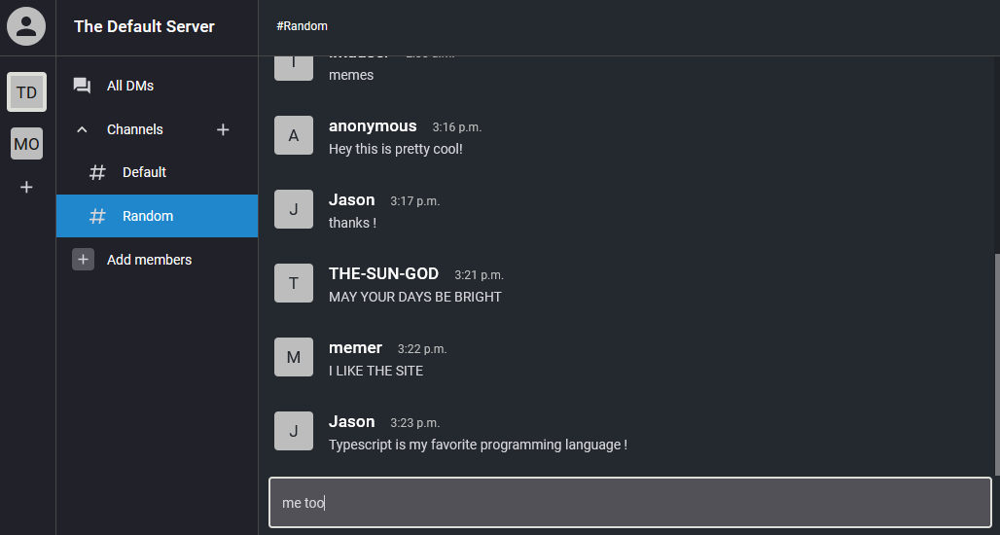

<!-- ABOUT THE PROJECT -->

## About The Project

API for a clone of the popular messaging app Slack.  
Check out the [front end client repository](https://github.com/jayeeson/SlackCloneClient) here.


<!-- GETTING STARTED -->

## Getting Started

To get a local copy up and running follow these simple steps.

### Prerequisites

Yarn and MySQL should be installed. MySQL process should be running.

### Installation

1. Clone the repo
   ```
   git clone https://github.com/jayeeson/SlackCloneApi.git
   ```
2. Install yarn packages
   ```
   yarn install
   ```
3. Create a `.env` file in the root folder with values for the following:
   - `TOKEN_SECRET`: a string that should be hard to guess
   - `DB_USER`: your MySQL username
   - `DB_PASS`: your MySQL password (if applicable)
   - `DB_PORT` (optional): port that MySQL is running on (default is `3306`)
   - `HOST` (optional): hostname where you want the app to run (default is `localhost`)
   - `PORT` (optional): port you want the app to run on (default is `3000`)

<!-- ROADMAP -->

<!-- LICENSE -->

## License

Copyright Jason Catel 2021

Distributed under the GPL v3.0 License. See [license](https://github.com/jayeeson/SlackCloneApi/blob/master/LICENSE) for more information.

<!-- CONTACT -->

## Contact

Jason Catel - jgcatel@gmail.com

<!-- MARKDOWN LINKS & IMAGES -->
<!-- https://www.markdownguide.org/basic-syntax/#reference-style-links -->

[contributors-shield]: https://img.shields.io/github/contributors/jayeeson/repo.svg?style=for-the-badge
[contributors-url]: https://github.com/jayeeson/SlackCloneApi/graphs/contributors
[forks-shield]: https://img.shields.io/github/forks/jayeeson/repo.svg?style=for-the-badge
[forks-url]: https://github.com/jayeeson/SlackCloneApi/network/members
[stars-shield]: https://img.shields.io/github/stars/jayeeson/repo.svg?style=for-the-badge
[stars-url]: https://github.com/jayeeson/SlackCloneApi/stargazers
[issues-shield]: https://img.shields.io/github/issues/jayeeson/repo.svg?style=for-the-badge
[issues-url]: https://github.com/jayeeson/SlackCloneApi/issues
[license-shield]: https://img.shields.io/github/license/jayeeson/repo.svg?style=for-the-badge
[license-url]: https://github.com/jayeeson/SlackCloneApi/blob/master/LICENSE.txt
[linkedin-shield]: https://img.shields.io/badge/-LinkedIn-black.svg?style=for-the-badge&logo=linkedin&colorB=555
[linkedin-url]: https://linkedin.com/in/jason-catel
